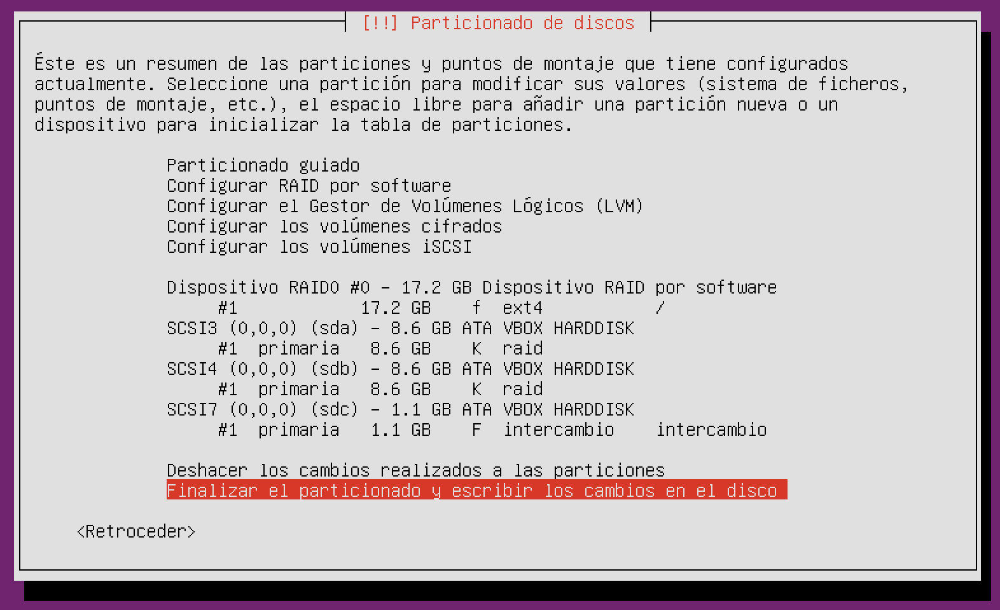
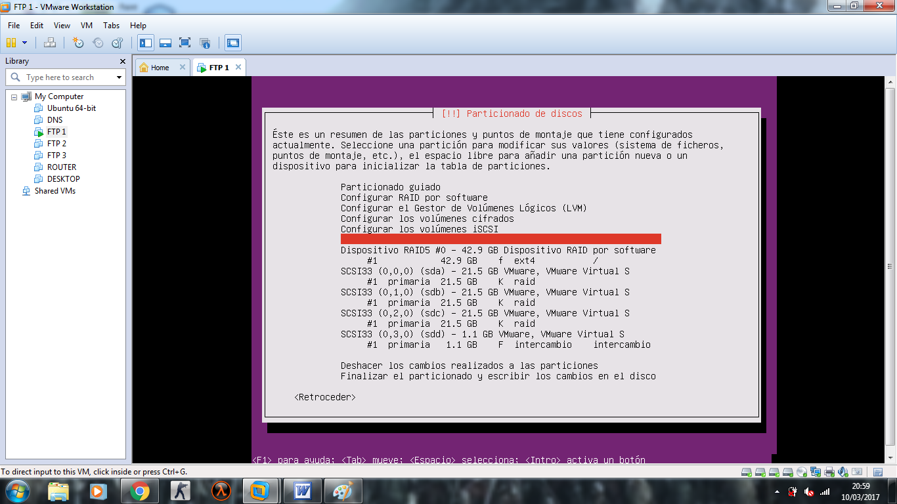
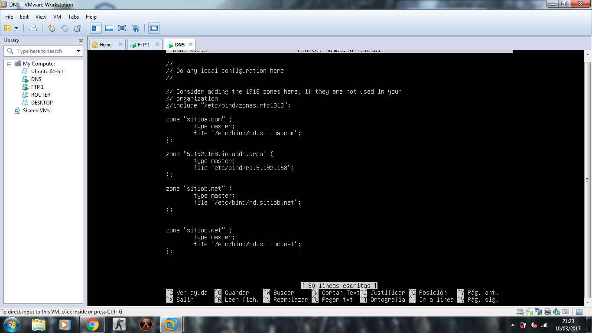
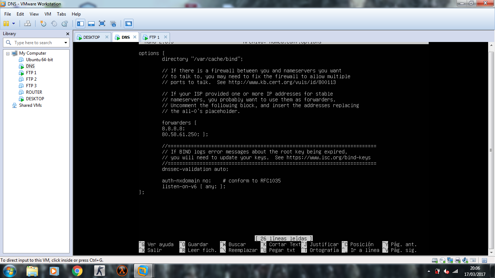
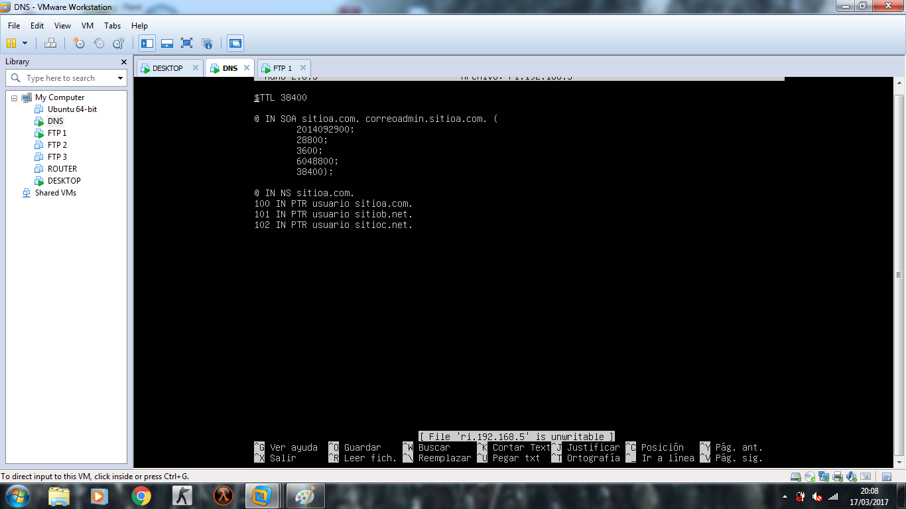
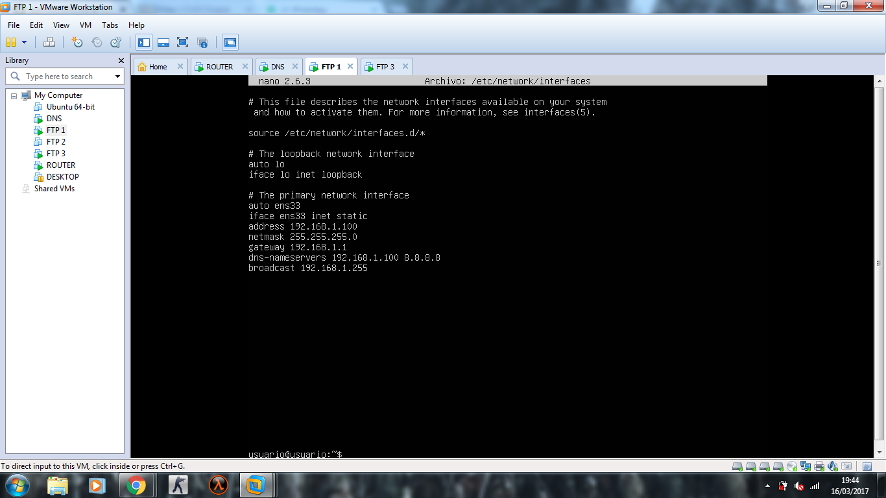
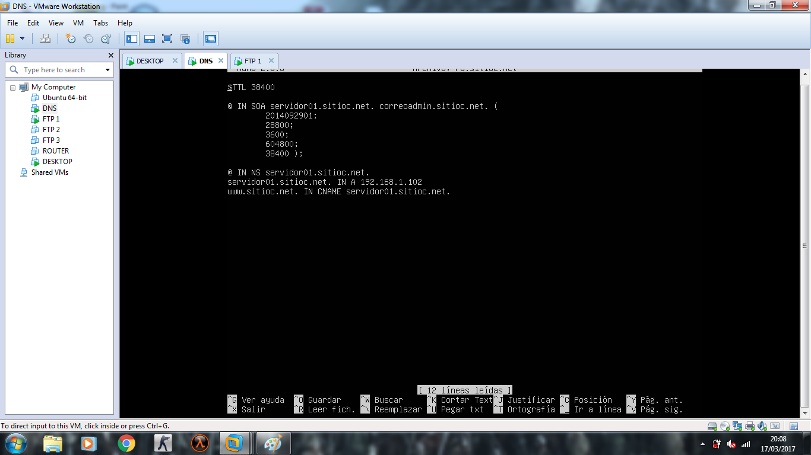
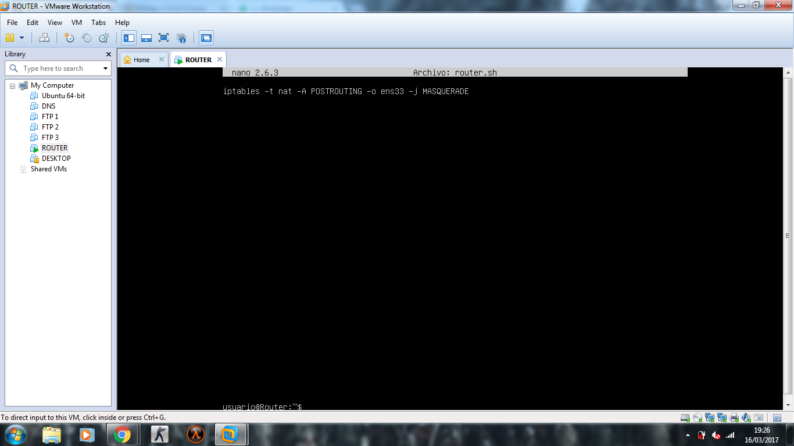

Primero creamos el servidor DNS con raid 0.

Luego creamos los servidores Web con raid 5.

Y configuramos el servidos DNS

Configuramos los servidores Web

Configuramos el servidor del Router

